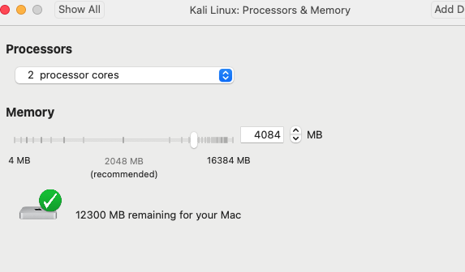
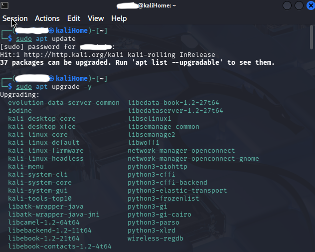
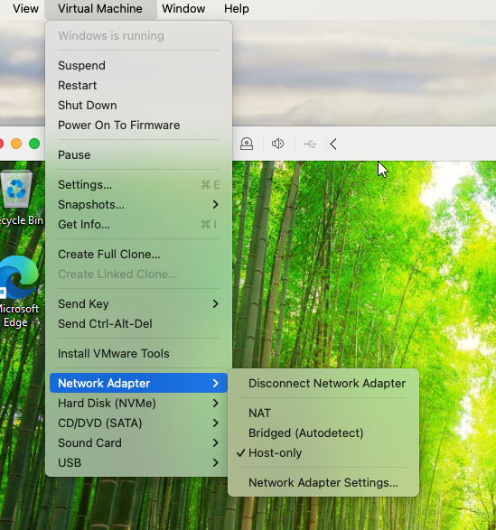
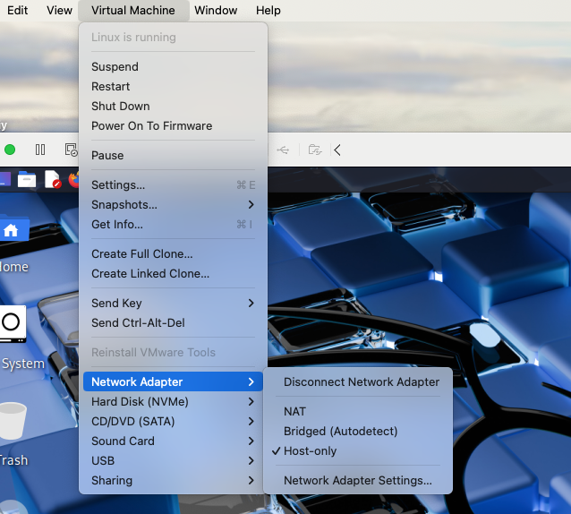
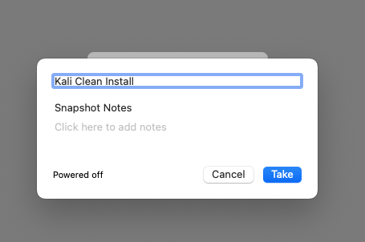
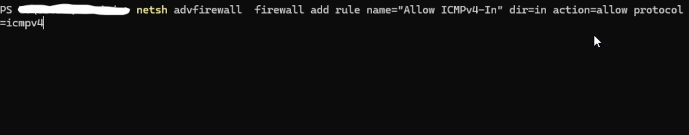
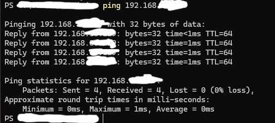
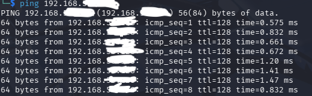

# Home SOC Lab Build

## Overview
This project documents the creation of a home Security Operations Center (SOC) lab designed to simulate, monitor, and analyze security events in a controlled environment. The lab provides hands-on experience with virtualization, networking, and security monitoring tools.

## Lab Architecture
- Host Machine: macOS
- Hypervisor: VMware
- Attacker VM: Kali Linux
- Target VM: Windows 11
- Network Type: Host-Only

## Virtual Machine Setup

### Kali Linux VM
- RAM: 4 GB
- CPU: 2 cores
- Network Adapter: Host-Only
- System updated using `sudo apt upgrade -y`

### Windows VM
- RAM: 4 GB
- CPU: 2 cores
- Network Adapter: Host-Only

## Methodology

### Step 1: Installing Virtual Machines
1. Install VMware
2. Download the Kali Linux Iso and Windows Iso files
3. Upload the Iso files to VMware

### Step 2: Set up Virtual Machines
Kali Linux VM configuration

Windows 11 VM configuration

### Step 3: Put both VMs on the same isolated network

### Step 4: Take a snap of each VM

### Step 5: Network Configuration and Connectivity
1. Verify IP addresses using `ifconfig` and `ipconfig`
2. Initial ICMP traffic was blocked by Windows Firewall, so I created a firewall rule to allow ICMP activity
3. Confirmed connectivity using `ping`

## Security Purpose
This lab supports:
- Attack simulations (DoS, brute force)
- Packet analysis
- Log review and incident response practice

## Outcome
A fully functional home SOC lab capable of supporting security testing, monitoring, and analysis activities.

⚠️ All IP addresses have been redacted.  
This lab was conducted in a controlled environment for educational purposes.

## Future Enhancements
- Siem Integration
- Virtual Firewall
- Alerting Rules
- Attack Simulations
